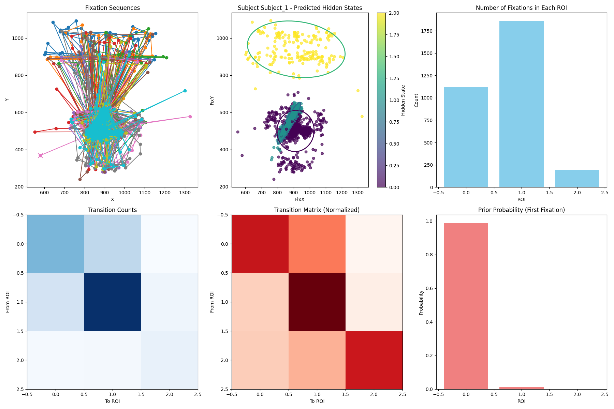
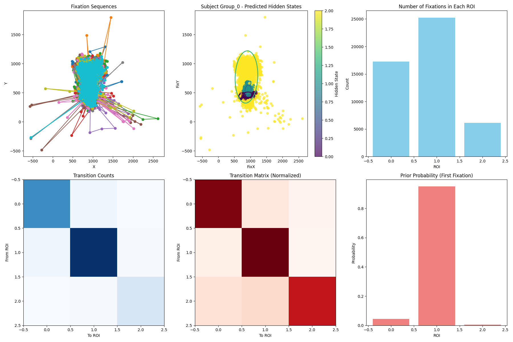

# Scanpath Modeling with Hidden Markov Models

## Overview

This repository implements a framework for analyzing and modeling eye movement scanpaths using Hidden Markov Models (HMMs). Inspired by **"Scanpath Modeling and Classification with Hidden Markov Models"** by Antoine Coutrot et al. (2017) and **"Clustering Hidden Markov Models with Variational HEM"** by Emanuele Coviello et al. (2012), the project integrates data-driven approaches for robust classification, clustering, and visualization of gaze behavior.

The project allows for:
- Modeling individual or grouped scanpaths using HMMs.
- Classifying observers or visual stimuli based on gaze data.
- Clustering HMMs using the Variational HEM algorithm for more compact representations.

---

## Key Features

1. **Hidden Markov Models for Gaze Analysis**  
   - Models scanpath sequences as transitions between regions of interest (ROIs).
   - Incorporates bottom-up and top-down factors in gaze behavior.

2. **Classification**  
   - Leverages discriminant analysis with HMM parameters for classification tasks.
   - Supports observer and stimuli characteristic inference.
   

3. **Clustering**  
   - Implements Variational HEM for clustering HMMs into groups with representative cluster centers.
   

4. **Visualization**  
   - Generates intuitive plots for HMM states, transitions, and emission densities.

---

## Installation

### Prerequisites

- Python 3.8+
- Poetry for dependency management
- Required libraries specified in `pyproject.toml`

